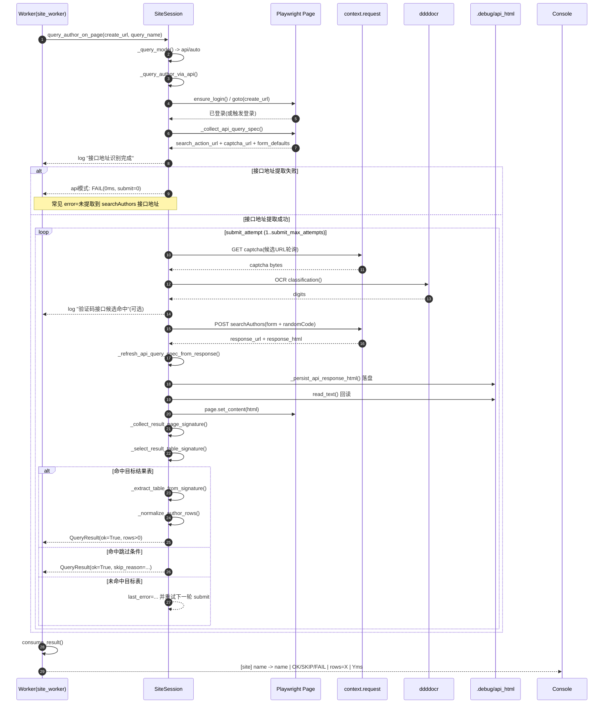

# author_query

用于投稿系统的“作者查询”自动化脚本：

- 支持多站点（多个投稿系统 URL）
- 支持姓名列表 + 相似名批量生成（默认每个原名最多 10 个，可配置）
- 自动识别数字验证码并提交查询
- cbkx 站点支持“接口优先查询”（失败自动回退页面模式）
- 按并发度并发查询
- 将结果 **追加** 写入 Markdown（不覆盖历史）

## 目录结构

- `main.py` 主脚本
- `config.example.yaml` 配置模板（建议另建 `config.yaml` 存放真实配置）
- `names.txt` 待查询姓名列表（每行一个）
- `requirements.txt` 依赖
- `.state/` 运行时生成：Playwright 会话缓存（包含 cookie 等敏感信息）
- `.debug/` 运行时生成：失败时的截图/HTML（用于排障）

## 安全与合规提醒

此脚本会自动化登录并处理验证码。请确保你对目标站点具备合法访问权限，并遵守站点的使用条款与访问频率限制（并发建议从小到大逐步调高）。

## 安装

1. 安装依赖

```bash
cd autoTools/author_query
python -m pip install -r requirements.txt
```

> 说明：`ddddocr` 已锁定为 `>=1.5.6,<1.6.0`。若本机已安装 `1.6.0` 并报 `cannot import name 'DdddOcr'`，可执行：
>
> `python3 -m pip install "ddddocr>=1.5.6,<1.6.0" --upgrade --force-reinstall`

2. 浏览器准备（默认优先本机 Chrome）

- 脚本默认优先复用本机已安装的 Chrome 内核。
- 若你希望在本机 Chrome 不可用时回退 Playwright 自带 Chromium，再执行：

```bash
python -m playwright install chromium
```

## 配置

1. 基于 `config.example.yaml` 创建 `config.yaml`，主要需要填写：

- `sites[].login_url`
- `sites[].create_urls`（可多条）
- `sites[].credentials.username/password`（推荐使用环境变量注入）
- 选择器（默认已给出 cbkx 的参考选择器）

2. 推荐用环境变量提供账号密码（避免写入明文）

```bash
export CBKX_USER="你的账号"
export CBKX_PASS="你的密码"
```

3. 浏览器内核配置（可选）

```yaml
global:
  browser:
    prefer_local_chrome: true
    channel: "chrome"
    # macOS 示例：
    # executable_path: "/Applications/Google Chrome.app/Contents/MacOS/Google Chrome"
    executable_path: ""
    fallback_to_playwright_chromium: true
```

4. 查询通道配置（可选）

```yaml
global:
  query:
    # auto: 优先接口，失败回退 UI
    # api: 仅接口（不回退）
    # ui: 仅页面点击
    mode: auto
    http_timeout_ms: 25000

sites:
  - name: "cbkx_whu"
    query_mode: auto
```

## cbkx 关键接口

- 登录提交：`/Journalx_cbkx/j_acegi_security_check`
- 验证码：`/Journalx_cbkx/kaptcha.jpg?d_a_=<timestamp>`
- 作者查询：`/Journalx_cbkx/author/Contribution!searchAuthors.action?id=...&flag=0&processId=...&comm=...`

> 说明：`id/processId` 由页面脚本动态生成，脚本会在运行时自动提取并刷新。

## 接口模式时序图

> 说明：当前 `api/auto` 仍依赖 Playwright 的 `BrowserContext` 与 `context.request`，并非纯 `requests` 模式。



## 运行

默认读取 `autoTools/author_query/config.yaml`：

```bash
python autoTools/author_query/main.py --config autoTools/author_query/config.yaml
```

覆盖姓名列表文件：

```bash
python autoTools/author_query/main.py --config autoTools/author_query/config.yaml --names autoTools/author_query/names.txt
```

覆盖并发度：

```bash
python autoTools/author_query/main.py --config autoTools/author_query/config.yaml --concurrency 3
```

## 输出

默认输出路径在 `config.yaml -> global.output` 中配置（相对路径以 config 文件所在目录为基准）：

- `../userList.md`：追加写入本次运行的结果章节（每次运行一个新章节）
- `../failed_names.md`：追加写入失败清单章节
- `../userList.jsonl`：可选，追加写入结构化日志（便于后续统计/清洗）

## 排障建议

- 登录失败：检查 `login_url` 与登录表单选择器（`#user_name` / `#password` / `submit`）
- 查询失败：查看 `autoTools/author_query/.debug/` 下对应的 `.png/.html`，确认页面结构是否变更
- 验证码识别失败：可增大 `global.captcha.ocr_max_attempts`，或把 `expected_digits` 设为 `0` 取消长度校验
- ddddocr 导入失败（`cannot import name 'DdddOcr'`）：卸载并重装兼容版本 `python3 -m pip install "ddddocr>=1.5.6,<1.6.0" --upgrade --force-reinstall`
- 浏览器启动失败：先在 `global.browser.executable_path` 指定本机 Chrome 可执行文件；必要时执行 `python -m playwright install chromium` 作为回退
- 风控/频率限制：降低 `global.concurrency`，并增加重试次数
